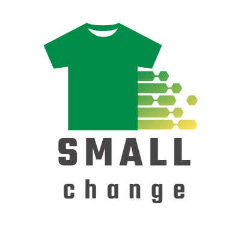
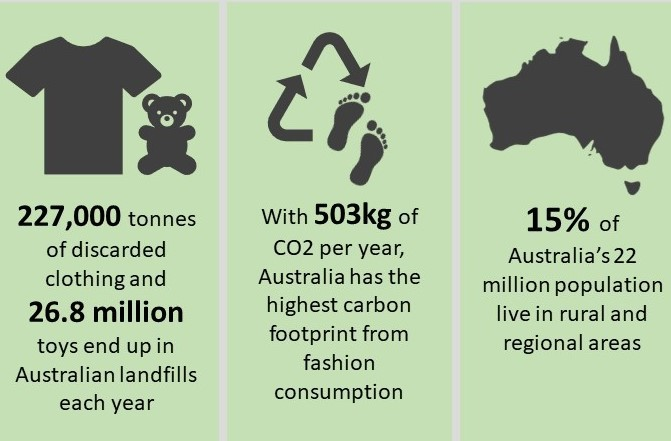

## From little things, big things grow.

Children grow up fast.

And as they do, they outgrow clothes, shoes, equipment and toys.

Small Change is here to help give your pre-loved goods a new lease on life.

```{r cars, echo=FALSE}



```

## Track your impact

Understanding the impact of a program is essential to determining its impact. Tracking a secondhand item throughout its lifecycle as it moves from person to person can generate important data and assist in creating a positive future for the program.

We track that impact using blockchain technology through our SmallChange tokens.  Blockchain can keep a record of the history of each donated item. This allows us to track the movement of the item through its lifecycle and helps us create data sets based on the age of the child/ren, location, how long the item was used for, and can even help to connect communities and share stories through these shared goods. 

Tracking items usage also ensures that items do reach their intended recipient. This helps create transparency within the charity and allows charities to remain genuine and trustworthy in the eyes of the donors and the general public. 

Additionally, tracking items helps donors feel like they are personally helping and involved in the donation process. Many individuals have emotional connections to preloved items and want to know that their items are still being used and appreciated. And if we find a strong match between donors and recipients, it’s likely that their future unwanted goods can find a second life.

Allowing donors to watch their item move through its lifecycle also builds a relationship between the donor and the charity. This makes the donor more likely to donate their items in the future through the same charity and prevent more items from entering landfill. 

Lastly, tracking also allows us to identify areas where individuals need more support. According to RemoteOpShop.org, about 15% out of Australia’s 22 million population live in rural and remote areas. Individuals in these areas are more likely to need affordable second-hand items and are less likely to donate items due to the lack of accessibility and availability of charity stores. 

By tracking items and their impact, we can see which areas are receiving needed items and which areas may be being left behind. Additionally, we can see which specific items are in-high demand in specific areas and ensure that when items are donated, we can prioritise those locations.   


```{r pressure, echo=FALSE}
library(ggplot2)
ggplot(pressure, aes(x=temperature, y=pressure)) +
  geom_point() + 
  geom_segment( aes(x=temperature, xend=temperature, y=0, yend=pressure)) +
  xlab("Donations") + ylab("Impact")
```

## Giving where it matters
We have analysed data from the census and combined it with other geography-based measures of socio-economic status to match the impact of your donations to where it counts.

As more people use SmallChange, our algorithms will improve to match profiles. We will connect you with a community of givers who are making small differences in how they give a new lease on life to children's clothes, and these differences stack up!

```{r trash, echo=FALSE}



```

### About our givers

As a giver, you’re helping to continue the life of your goods by giving them to a family in need. In return, we’ll credit you with our small change token based on the value of your contribution and the quality of your goods. These tokens can be used at any of our partner providers to purchase new-to-you clothes, toys, uniforms and equipment, or contribute towards a tax-deductible charity donation.

You can drop off your donations at any of our partner stores. 

You’ll be able to track the impact of your gift through our app, to see how many more lives your generosity can touch, and how these memories can avoid the landfill, helping to reduce our community’s environmental footprint by reducing demand for new garments.

Reducing the amount of discarded clothing and toys in landfills brings important benefits that go beyond just dealing with waste. One big advantage is that it helps lower the amount of carbon footprint. When we throw away these items in landfills, they break down and release gases that contribute to climate change. By not putting them in landfills, we're helping to reduce these gases and their effects on the planet. Another important thing is that it stops dangerous chemicals and plastics from getting into the environment. Landfills have the potential to release harmful substances that can contaminate soil and water, causing pollution. By keeping clothes and toys out of landfills, we're making sure our surroundings stay cleaner and healthier for nature and us. Overall, when we make sure less clothing and toy waste ends up in landfills, we're taking steps toward a better and more balanced environment for everyone.

Even better! Shipping/postal costs that occur when the partners send the much-needed items from donor to recipients will be eligible as a tax offset for the partner. This allows us to keep the costs low, gives the partners an important incentive and supports our sustainable donation system. 


### About our partners

Our charity partners are the superheroes that allow SmallChange to thrive! 

Join us in witnessing the tireless dedication of our partners, forging swift and efficient connections between donors and recipients. With our partners strategically positioned across major Australian cities, we're not just stopping there – we're determined to extend our reach to touch as many lives as possible. As we approach 2024, a bold mission emerges: to venture deeper into rural, regional, and remote communities through a fleet of dedicated trucks. Imagine the impact as we roll into smaller locales, gathering their contributions and delivering precisely what's needed. Our journey is one of shared compassion, a road that leads to empowerment and fulfillment in communities often overlooked. Stand with us as we drive change, neighbourhood by neighbourhood, heart by heart.